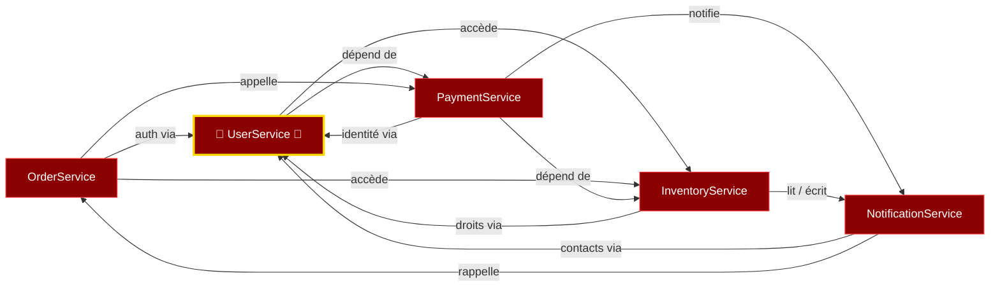

---
# try also 'default' to start simple
theme: seriph
# random image from a curated Unsplash collection by Anthony
# like them? see https://unsplash.com/collections/94734566/slidev
# some information about your slides (markdown enabled)
title: "Le Seigneur du Legacy"
info: |
  ## Le Seigneur des Couplages
  Une histoire de dette technique en Terre du Milieu
# apply UnoCSS classes to the current slide
class: text-center
author: Edouard Mangel 
keywords: couplage, architecture, legacy, dette technique
# https://sli.dev/features/drawing
drawings:
  persist: false
# slide transition: https://sli.dev/guide/animations.html#slide-transitions
transition: slide-left
# enable MDC Syntax: https://sli.dev/features/mdc
mdc: true
# duration of the presentation
duration: 45min
layout: image
image: /images/lord-of-the-rings.jpg

---

# Le Seigneur du Legacy 

## La Communauté du Code

*"Un code pour les gouverner tous, un code pour les lier..."*

<!-- 
Accroche : Qui ici a déjà travaillé sur un "framework maison" ?
Lever la main si vous avez déjà entendu "c'était mieux avant, quand Jean-Michel était là"
-->

---
layout: image-right
image: /images/barad-dur.jpg
---

# Introduction

## De quoi allons-nous parler ? 

 

- De Legacy, 

<v-clicks>

- De couplage,

- De refactoring, 

- De mes troubles liés au stress post-traumatique 

</v-clicks>

<!-- 

Il est encore temps d'appliquer la loi des deux pieds ;)

-->

---
layout: intro
image: /images/Frodo_Baggins-house.jpg
---

# Introduction

## Présentation de LegacyCorp

---
layout: image
image: /images/ring-melting.jpg
backgroundSize: 80%
---

# Les Anneaux de Pouvoir

--- 
layout: image
image: /images/3_rings.jpeg
backgroundSize: 90%
--- 

# 3 services pour les ops

<!-- 
3 services pour les ops
Jenkins, 
Lambda functions, 
Kubernetes
-->

--- 
layout: image
image: /images/7_rings.jpeg
backgroundSize: 80%
--- 

# 7 anneaux pour les dev

<!-- 
7 services pour les développeurs
Mongo Redis Oracle GraphQL MySql, postgres, DynamoDB
-->

---
layout: image
image: /images/9_rings.jpg
backgroundSize: 90%
---

# 9 anneaux pour les managers

<!--

9 services pour les managers

plus facilement corrompus, à cause de leur proximité avec les humains et leur recherche de pouvoir

Jira, 
Confluence, 
Teams, 
Slack, 
SharePoint
-->

--- 
layout: image
image: /images/The_one_ring.png
backgroundSize: 40%
---

# Un anneau pour les coupler tous 

---
zoom: 1.2
--- 

# Un anneau pour les coupler tous 

## Le couplage, qu'est-ce que c'est ? 

 

<v-clicks>

- Une mesure pour mesurer le volume d'informations échangé par 2 composants. 

- Plus des composants partagent d'information, et plus la modification d'un des deux nécessite de modifier l'autre. 

- C'est une notion transitive : si A est fortement couplé à B, et que B est fortement couplé à C, alors A et C sont aussi fortement couplés.

</v-clicks>

<!-- 

On parle de couplage « fort » ou « serré » entre deux composants s’ils échangent beaucoup de données. 

- Au contraire, on parle de couplage faible s’ils sont indépendants ou s’ils échangent un minimum de données
-->

--- 

# 💍 Couplage fort : un enchevêtrement dangereux

Tous les services dépendent de UserService — l'Anneau Unique qui les lie tous.

---

# LegacyCorp : Un Royaume Enchaîné par son Passé
Un monolithe si enchevêtré que personne n’ose plus y toucher…

## Problèmes clés

<v-click>

✅ Le Monolithe Maudit 

</v-click>

 

<v-click>

✅ Les Dépendances Invisibles 🕸️

</v-click>

 

<v-click>

✅ La Dette Technique ⌛

</v-click>

<!--

→ "Modifier une ligne = risque de tout casser."

→ "Un changement dans le module de templates peut casser le module d'envoi de mails… sans que personne ne sache pourquoi."

→ "Chaque nouvelle feature ajoute 10 bugs. Les devs passent 80% de leur temps à corriger."

-->

---

# Une forteresse bâtie sur du sable 
If it works, don't fix it ! 

## Les conséquences 

<v-click>

❌ On ne refactore plus

</v-click>
 

<v-click>

❌ On néglige la qualité

</v-click>
 

<v-click>

❌ On ne peut plus rien planifier

</v-click>

<!-- 

→ La structure du code pourrit petit à petit

→ On passe son temps à appliquer des pansements, on n'a pas le temps pour les changements profonds

→ Les tickets restent dans un état "presque fini" pendant des semaines.

-->

--- 
layout: image 
image: /images/orcs.jpg
backgroundSize: 70%
---

# Les équipes sont esclaves des bugs 

--- 
layout: statement
--- 

## Une menace grandissante

# La concurrence arrive !

Pendant que les efforts sont concentrés sur la maintenance du legacy, des start-ups travaillent dans l'ombre et menacent le marché de LegacyCorp. 

---
src: ./slides/acte-1.md
---

---
src: ./slides/acte-2.md
---

---
src: ./slides/acte-3.md
---

---
src: ./slides/acte-4.md
---
